# KGP 4x2209 FunctionalTest

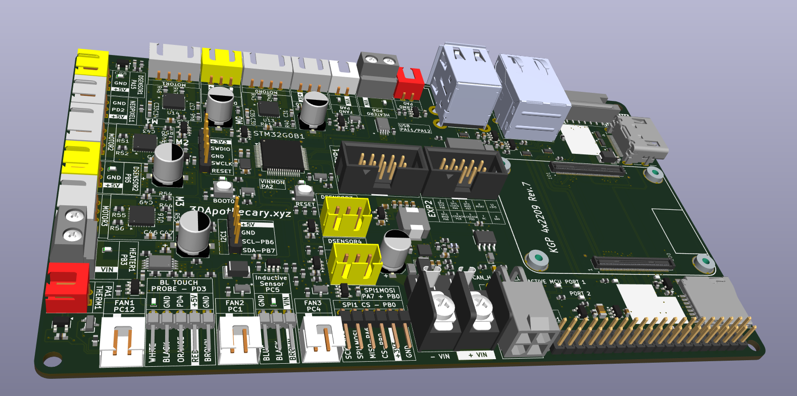

## Functional Test Apparatus

* Manufacturer Supplied: KGP 4x2209 "Board Under Test"
* Manufacturer Supplied: 24V/5A "Bench Power Supply" with Digital Outputs and Overcurrent Protection
* Manufacturer Supplied: 1920 x 1080p "HDMI Monitor"
* Manufacturer Supplied: Full Sized HDMI Cable (for Board Under Test to HDMI Monitor)
* Manufacturer supplied: Ethernet Cable with RJ45 Connector to Active Internet Connection
* Company Supplied: USB Keyboard (US Key Layout)
* Company Supplied: Silicon Solder Pad with Test Apparatus Markings and Parts
* Company Supplied: [Raspberry Pi CM4 (CM4101000)](https://datasheets.raspberrypi.com/cm4/cm4-product-brief.pdf)
* Company Supplied: Micro SD Card 64GB or larger
* Company Supplied: Red/Black Power Wiring from Bench Power Supply to Board Under Test
* Company Supplied: ["NewHat2" Raspberry Pi GPIO Hat](https://github.com/3dApothecary-xyz/NewHat2)
* Company Supplied: 6 Pin Ribbon Cable from NewHat2 to Board Under Test
* Company Supplied: Red JST XH 3 Pin to Dupont 3 Pin Socket Wire
* Company Supplied: Black JST XH 3 Pin to Dupont 3 Pin Socket Wire
* Company Supplied: Yellow JST XH 3 Pin to Dupont 3 Pin Socket Wire
* Company Supplied: Blue JST XH 3 Pin to Dupont 3 Pin Socket Wire
* Company Supplied: Green JST XH 3 Pin to Dupont 3 Pin Socket Wire
* Company Supplied: 4x 15cm long 24V LED Strip Lighting on 2 Pin Dupont Connector
* Company Supplied: 2x 8 NeoPixel LED strips on 3 Pin Dupont Connector
* Company Supplied: ADXL345 Prototype Board with 8 Pin Header 
* Company Supplied: 6Pin Ribbon Cable with 8 Pin Dupont Connector and 6 Pin Dupont Connector
* Company Supplied: BTT EBB42 Toolhead Controller
* Company Supplied: CANBus Cable to Connect Board Under Test to BTT EBB42 Toolhead Controller
* Company Supplied: [Antclabs "BLTouch" v3.1 Sensor](https://www.antclabs.com/bltouch-v3) Mounted to "BLTouch" Stepper Motor Base
* Company Supplied: "BLTouch" Custom Stepper Motor Base with Striker Mount on Stepper Motor
* Company Supplied: 12V+ Inductive Probe Mounted to Stepper Motor Base
* Company Supplied: 12V+ Inductive Probe Custom Stepper Motor Base with Striker on Stepper Motor
* Company Supplied: 2x Custom Motor Base with Striker
* Company Supplied: 4x Lerdge NEMA 17 42mm Motors with Dupont Connectors

## NewHat3a/HeaterBoard Functions SBC 40 Pin Header Connections

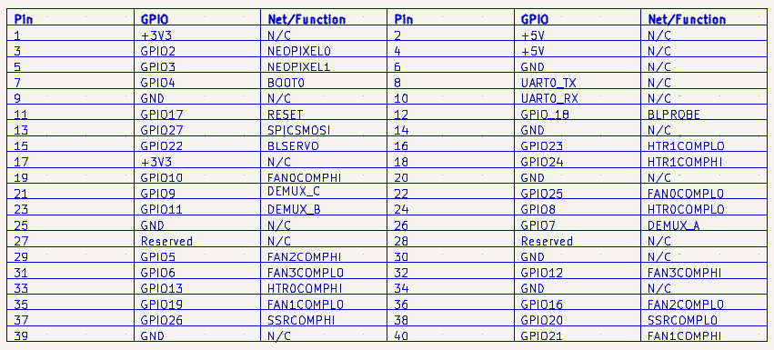

## Functional Test Electrical Setup Process

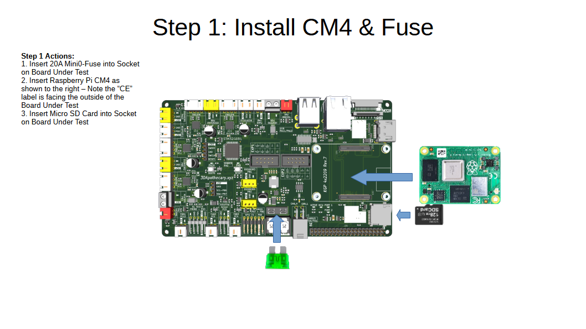

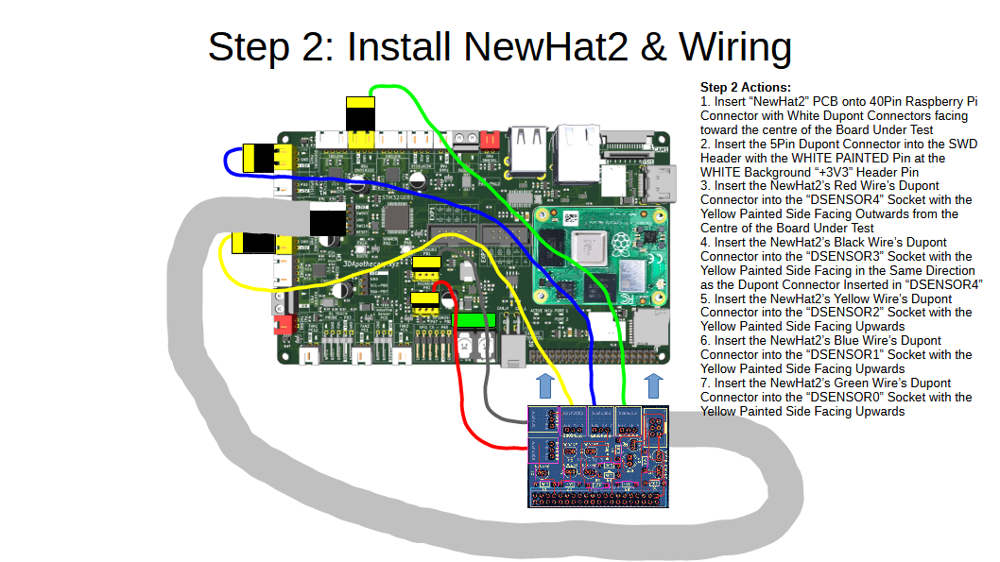

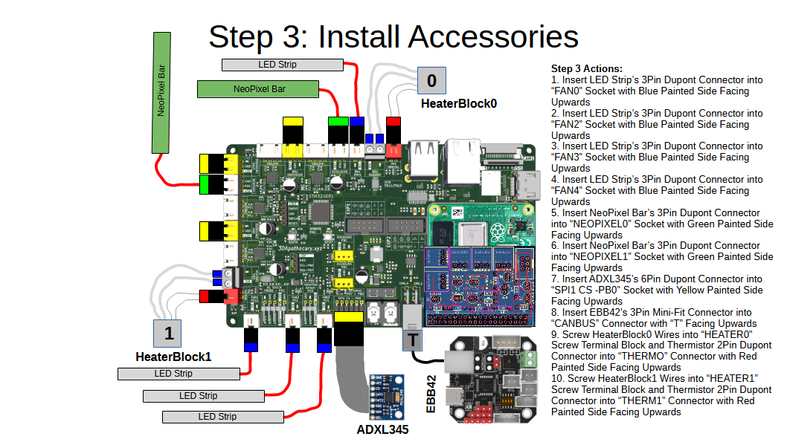

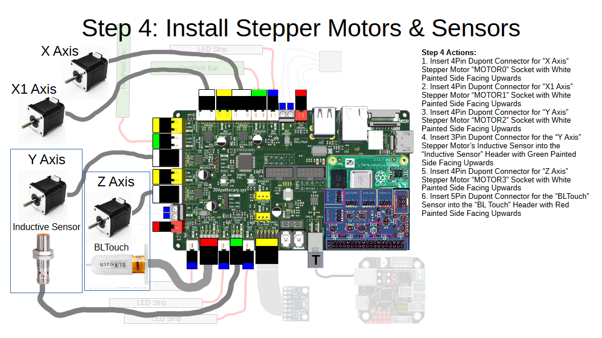

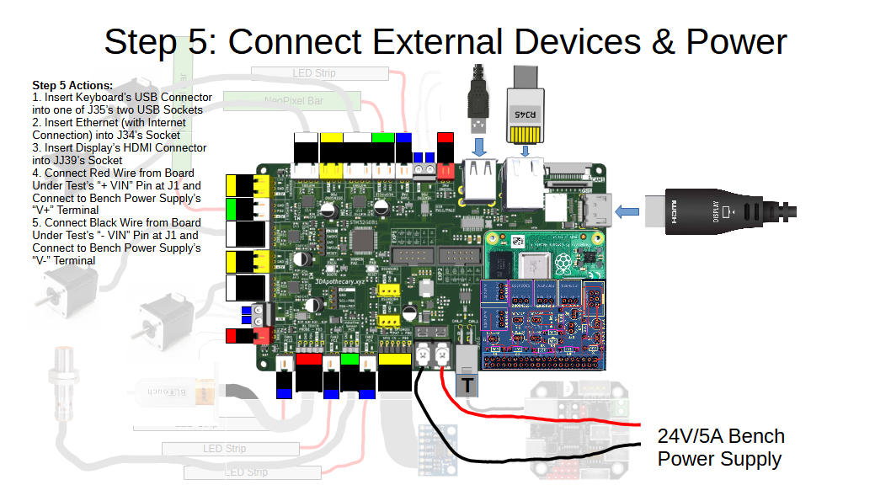

## Functional Test Process

* `sudo service klipper stop`

* Show "FIRMWARE LOAD" Message

* if DFU Mode Active
```
      loadKatapult=1
```
* else

*     loadKatapult=0
  
*     enableKatapult.py

*     sleep 2

*     if **NOT** Katapult Active
*         Cycle Reset 2x (Enable Katapult in MCU)
*         if Katapult Active
*             loadFlag = 3
*         else
*             ERROR - Unable to load firmware into Board Under Test's MCU

* if (loadFlag & 4)  //  Board will be in DFU Mode
*     Flash `katapult.bin` using dfu-util
*     sleep 1
*     Cycle Reset 2x (Enable Katapult in MCU)
*     sleep 1

* if NOT Katapult Active
*     ERROR - Unable to load firmware into Board Under Test's MCU

* if (loadFlag & 2)  //  Flash DFU Enable in Option Bytes
*     Flash `SKR_Mini_E3_V3_DFU.bin` using Katapult
*     sleep 1
*     Cycle Reset 2x (Enable Katapult in MCU)
*     sleep 1

* if NOT Katapult Active
*     ERROR - Unable to load firmware into Board Under Test's MCU

* if (loadFlag & 1)  //  Flash Klipper Firmware
*     Flash `klipper.bin` using Katapult
*     sleep 1
*     Cycle Reset 2x (Enable Katapult in MCU)
*     sleep 1

* Show "KLIPPER START" Message

*     if `mcu.cfg` exists
*         erase `mcu.cfg`

* Using `ls /dev/serial/by-id` Create `mcu.cfg`

* `sudo service klipper start`

* sleep 5s // **NOTE:** This needs to be timed to understand how long it takes for Klipper to come up

*     for (i = 0; 5 > i; ++i)
*         if klipper "READY"
*             break
*         endif
*         sleep 1
*         execute FIRMWARE_RESTART
*         sleep 5 # <=== **NOTE:** This needs to be time to understand how long is required for Klipper to come up
*     if 5 <= i
*         ERROR - Klipper not coming up after MCU Flashed with Katapult, DFU Mode Enable, Klipper firmware

* Show "FUNCTIONAL TEST START" Message

* `TEST01:` Network Connections (Ping Internet Site to test Board Under Test's Ethernet Port using `sineosPING.sh`)
* `TEST02:` Read Power Input (`VINMON`) Level (Check Input Power Level)
* `TEST03:` Read MCU Temperature (MCU Presence Check)
* `TEST04:` Read Toolhead MCU Temperature (Toolhead Presence Check)
* `TEST05:` Ensure (`HEATER0` temp < 30C) && (`HEATER0` temp > 0C) (`HEATER0` thermistor Presence Check and at temperature appropriate for `HEATER0` functional test)
* `TEST06:` Ensure (`HEATER1` temp < 30C) && (`HEATER1` temp > 0C) (`HEATER1` thermistor Presence Check and at temperature appropriate for `HEATER1` functional test)
* `TEST07:` Set `HEATER0` to 40C (This is an operation that cannot pass or fail but given the label "TEST" so it can use the standard test macro formatting)
* `TEST08:` Set `HEATER1` to 40C (This is an operation that cannot pass or fail but given the label "TEST" so it can use the standard test macro formatting)
* `TEST09:` ADXL345 Presence Check
* `TEST10:` BLTouch Presence Check (Also Set Probe Position and check probe status)
* `TEST11:` `NEOPIXEL0` Presence Check (User Operator must confirm `NEOPIXEL0` has a red output.  `NEOPIXEL0` is turned off after test)
* `TEST12:` `NEOPIXEL1` Presence Check (User Operator must confirm `NEOPIXEL1` has a red output.  `NEOPIXEL1` is turned off after test)
* `TEST13:` `DSENSOR0` Functional Test (Operator to confirm that Yellow LED by Connector is lit)
* `TEST14:` `DSENSOR1` Functional Test (Operator to confirm that Yellow LED by Connector is lit)
* `TEST15:` `DSENSOR2` Functional Test (Operator to confirm that Yellow LED by Connector is lit)
* `TEST16:` `DSENSOR3` Functional Test (Operator to confirm that Yellow LED by Connector is lit)
* `TEST17:` `DSENSOR4` Functional Test (Operator to confirm that Yellow LED by Connector is lit)
* `TEST18:` 'FAN0' Operations Check (Operator to confirm Blue LED on Board Under Test is lit and LED strip is lit.  After confirmation `DSENSOR1` is no longer driven so that Blue LED and LED strip are off)
* `TEST19:` 'FAN1' Operations Check (Operator to confirm Blue LED on Board Under Test is lit and LED strip is lit.  After confirmation `DSENSOR1` is no longer driven so that Blue LED and LED strip are off)
* `TEST20:` 'FAN2' Operations Check (Operator to confirm Blue LED on Board Under Test is lit and LED strip is lit.  After confirmation `DSENSOR2` is no longer driven so that Blue LED and LED strip are off)
* `TEST21:` 'FAN3' Operations Check (Operator to confirm Blue LED on Board Under Test is lit and LED strip is lit.  After confirmation `DSENSOR3` is no longer driven so that Blue LED and LED strip are off)
* `TEST22:` 'G28 X` Test to check stepper movement and sensorless homing operation 
* `TEST23:` 'G28 Y` Test to check stepper movement and sensorless homing operation
* `TEST24:` 'G28 Z` Test to check stepper movement and sensorless homing operation
* `TEST25:` Functional Test of Inductive Sensor on Y-Axis stepper 
* `TEST26:` Functional Test of BLTouch on Z-Axis stepper
* `TEST27:` Ensure 'HEATER0` > 30C (When complete, set `HEATER0` to 0C)
* `TEST28:` Ensure 'HEATER1` > 30C (When complete, set `HEATER1` to 0C)

* Show "TEST COMPLETE" Message
* `NEOPIXEL0` and `NEOPIXEL1` set to output blue light

* Show "FIRMWARE SEALING" Message

* `sudo service klipper stop`
* sleep 2
* Cycle Reset 2x (Enable Katapult in MCU - Assume that this will work and there's no need to check it's active)
* sleep 2
* load `nada.bin`
* sleep 5

* `sudo shutdown now`

## Raspberry Pi CM4 Configuration Instructions

### Setup Raspberry Pi CM4 Operating System

1. Assume Raspberry Pi CM4 as the KGP 4x2209 Klipper "Host"
   
3. Use 64GB+ Micro SD Card for loading OS for the Raspberry Pi

4. Start up the Raspberry Pi Imager

5. Insert Micro SD Card for use with Raspberry Pi Imager

6. In Raspberry Pi Imager's Main Page, specify:
   * `RASPBERRY PI 4` for "Raspberry Pi Device"
   * `RASPBERRY PI OS LITE (64-BIT)` for "Operating System"
   * `Micro SD Card for use with Raspberry Pi Imager` for "Storage"
  
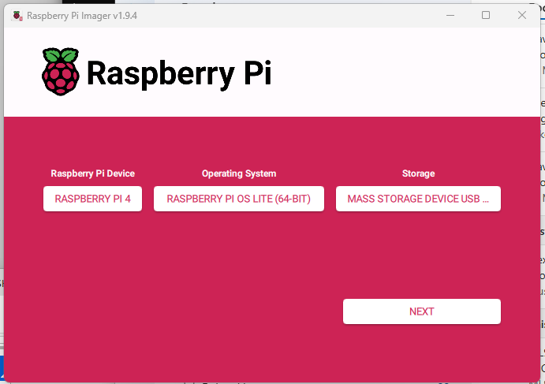

7. Click "Next" in Raspberry Pi Imager

8. The "OS Customisation" Window comes up.  Make the following entries:
   * "Set hostname:" to `kgpft1`
   * "Set username and password"
      * "Username:" to `biqu`
      * "Password:" to `biqu`
   * Deselect "Configure wireless LAN"
   * "Set locale settings"
      * "Time zone:" to `America/Toronto`
      * "Keyboard layout:" to `us`

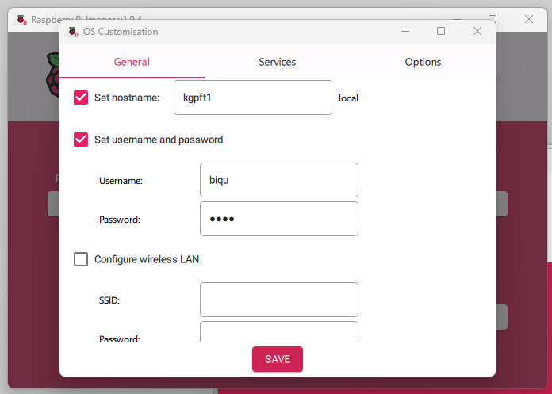

9. Click on `SAVE` in the "OS Customisation" Window and then click `Yes` to "apply OS customisation settings?"

10. Click on `Yes` to "Are you sure you want to continue?"

11. Wait for Micro SD Card to be configured

12. When finished, install the Micro SD Card into a `KGP 4x2209` board which has a Raspberry Pi CM4 installed

13. Connect the `KGP 4x2209` to an Ethernet internet connection
   
14. Apply power (ideally 24V) to the `KGP 4x2209`

15. Wait 5 minutes for first boot of the Raspberry Pi CM4

16. Using a computer which is connected to the same network as the Ethernet internet connection used by the `KGP 4x2209`:
    * Start up a "Command Prompt" (Windows) or "Terminal" (MacOS and Linux).  There is no need for PuTTY/Tera Term/etc.  
    * SSH into the board using
      ```
      ssh biqu@kgpft1
      ```
    * Enter `yes` if the question appears: "The authenticity of host 'kgpft1 ... Are you sure you want to continue connecting (yes/no/[fingerprint])?"
    * Enter the password `biqu`

17. Enter command below and make sure that the network response looks like screenshot following:
    ```
    ifconfig
    ```

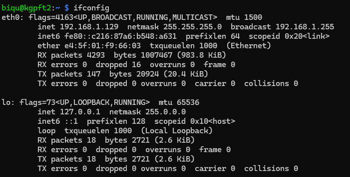

18. Enter
    ```
    sudo apt update
    ```
    * **NOTE:** This needs to be entered manually and cannot be done in a script

20. Enter
    ```
    sudo apt upgrade
    ```
    * **NOTE:** Don NOT put `-y` at end of command.  Responses beyond "Y" may be required

### Download Raspberry Pi & NewHat3a GPIO Utilities from GitHub

20. Execute bash script using:

    ```
    curl -s https://raw.githubusercontent.com/3dApothecary-xyz/FunctionalTest/refs/heads/main/scripts/ftload1.sh | bash
    ```
    
    * Download Installation utilties
        * `sudo apt-get install git -y`
        * `sudo apt install python3 python3-serial -y`

    * Dowload python utilities:
        * `mkdir python`
        * `cd python`
        * `wget -O cycle38.py https://github.com/3dApothecary-xyz/FunctionalTest/blob/main/python/cycle38.py?raw=true`
        * `wget -O cycleRESET.py https://github.com/3dApothecary-xyz/FunctionalTest/blob/main/python/cycleRESET.py?raw=true`
        * `wget -O enableDFU.py https://github.com/3dApothecary-xyz/FunctionalTest/blob/main/python/enableDFU.py?raw=true`
        * `wget -O enableKatapult.py https://github.com/3dApothecary-xyz/FunctionalTest/blob/main/python/enableKatapult.py?raw=true`
        * `wget -O gpioread.py https://github.com/3dApothecary-xyz/FunctionalTest/blob/main/python/gpioread.py?raw=true`
        * `wget -O toggleBOOT0.py https://github.com/3dApothecary-xyz/FunctionalTest/blob/main/python/toggleBOOT0.py?raw=true`
        * `chmod 777 *.py`
        * `cd ~`

    * Dowload Functional Test Script:
        * `wget -O ft.sh https://github.com/3dApothecary-xyz/FunctionalTest/blob/main/scripts/ft.sh?raw=true`
        * `chmod 777 *.sh`
        
    * Create `logs` directory
        * `mkdir logs`

    * Download Premade Firmare Images
        * `mkdir bin`
        * `cd bin`
        * `wget -O nada.bin https://github.com/3dApothecary-xyz/FunctionalTest/blob/main/bin/nada.bin?raw=true`
        * `wget -O KGP_4x2209_DFU.bin https://github.com/3dApothecary-xyz/FunctionalTest/blob/main/bin/KGP_4x2209_DFU.bin?raw=true`
        * `cd ~`

    * Load Klipper & Katapult using KIAUH
        * `git clone https://github.com/dw-0/kiauh.git`
        * `git clone https://github.com/Arksine/katapult`
        
21. Process for Klipper/Moonraker/Mainsail install using KIAUH
    * Enter:
      ```
      ./kiauh/kiauh.sh
      ```
    * If asked to try out KIAUH 6 enter `3` which is `3) Yes, remember my choice for next time`
        * Select `2) [Update]`
        * if Option `9) System` does NOT say `No upgrades available.` then:
            * Select `9) System`
            * Wait for System Updates to complete
        * Select `B) << Back` to exit Update Panel
        * Select `1) [Install]` to go to Klipper Installation Panel
        * Select `1) [Klipper]` to Install Klipper on the Raspberry Pi CM4.  Select default options when prompted
        * Select `2) [Moonraker]` to Install Moonraker on the Raspberry Pi CM4.  Select default options when prompted
        * Select `3) [Mainsail]` to Install Mainsail on the Raspberry Pi CM4.  Select default options when prompted
        * Select `B) << Back` to return to the main menu
        * Select `Q) Quit` to exit KIAUH

22. Check Klipper installation by loading the Mainsail webpage:
    ```
    http://kgpft1
    ```

24. Test python operation with:
    ```
    python python/cycle38.py
    ```
    * Check Pin 38 on KGP 4x2209's Raspberry Pi 40Pin Connector with a DMM: Pin should be cycling between 0V and 3.3V every 2 Seconds

### Enable CANBus Operation

24. The following commands and checks found at: [Estoterical CANBus Guide](https://canbus.esoterical.online/Getting_Started.html)
    ```
    sudo systemctl enable systemd-networkd
    ```

    ```
    sudo systemctl start systemd-networkd
    ```

    * Check to see that networkd is operating against the expected responese using the command:
    ```
    systemctl | grep systemd-networkd
    ```

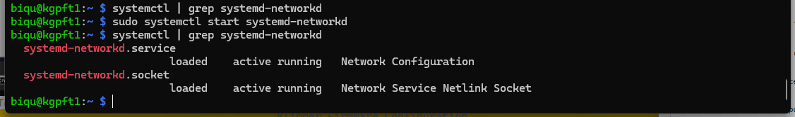

25. Enter:
    ```
    sudo systemctl disable systemd-networkd-wait-online.service
    ```

    ```
    echo -e 'SUBSYSTEM=="net", ACTION=="change|add", KERNEL=="can*"  ATTR{tx_queue_len}="128"' | sudo tee /etc/udev/rules.d/10-can.rules > /dev/null
    ```

    * Check to see that the CAN rules were applied correctly to the expected response below using the command: 
    ```
    cat /etc/udev/rules.d/10-can.rules
    ```

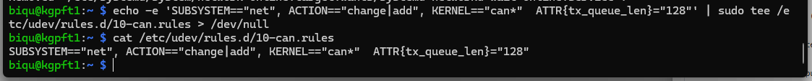

26. Enter:
    ```
    echo -e "[Match]\nName=can*\n\n[CAN]\nBitRate=1M\nRestartSec=0.1s\n\n[Link]\nRequiredForOnline=no" | sudo tee /etc/systemd/network/25-can.network > /dev/null
    ```

    * Check to see that the CAN Network Parameters were set correctly to the expected response below using the command: 
    ```
    cat /etc/systemd/network/25-can.network
    ```

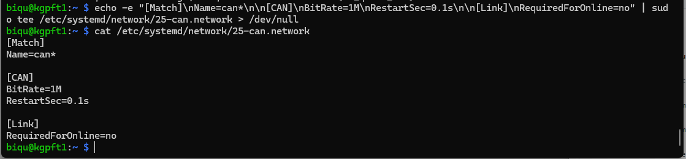

### Reboot to Setup CAN Features

27. Enter:

    ```
    sudo reboot now
    ```

28. Wait 2 minutes then `ssh biqu@kgpft1` and enter password `biqu` when prompted

29. Run `python python/cycle38.py` and check `http://kgpft1` to make sure everkything is okay

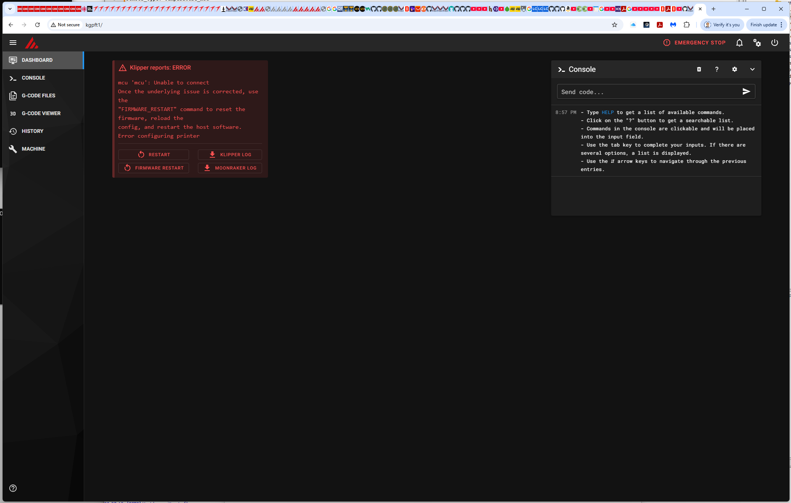

### Install Klipper on Raspberry Pi CM4 to allow Klipper to access the CM4's GPIO pins

30. Following instructions found at: [Klipper: Install the RC Script](https://www.klipper3d.org/RPi_microcontroller.html?h=raspb#install-the-rc-script)
    ```
    sudo cp klipper/scripts/klipper-mcu.service /etc/systemd/system/
    ```
    ```
    sudo systemctl enable klipper-mcu.service
    ```
    ```
    cd ~/klipper
    ```
    ```
    make menuconfig
    ```

31. Select "Linux process" for "MCU Architecture":

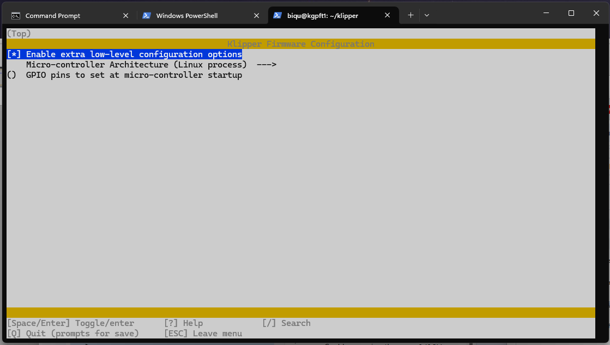

32. Make Klipper Image for CM4
    * Enter `Q` and then `Y` to quit and save the settings.
    ```
    make clean
    ```
    ```
    make
    ```

34. Stop Klipper Process in CM4 and install Klipper into the CM4
    ```
    sudo service klipper stop
    ```
    ```
    make flash
    ```

### Make Firmware Images

35. Make `klipper.bin` for Board Under Test 
    * Enter the following command and match settings with screen shot below and enter `Q` followed by `Y` to save
    ```
    make menuconfig
    ```
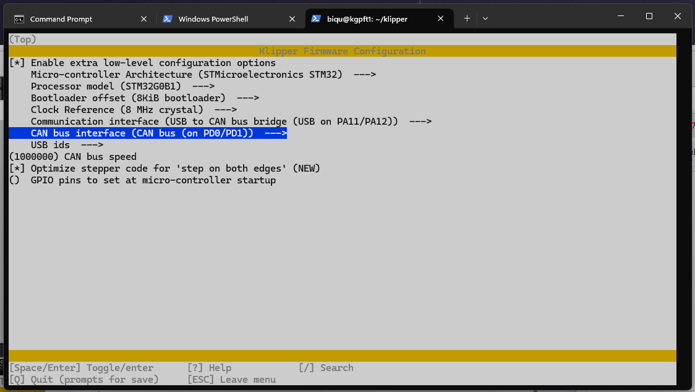

36. Enter
    * Enter `Q` and then `Y` to quit and save the settings.
    ```
    make clean
    ```
    ```
    make
    ```
    ```
    cp out/klipper.bin ~/bin
    ```

37. Make `katapult.bin` for Board Under Test 
    ```
    cd ~/katapult
    ```
    * Enter the following command and match settings with screen shot below and enter `Q` followed by `Y` to save
    ```
    make menuconfig
    ```
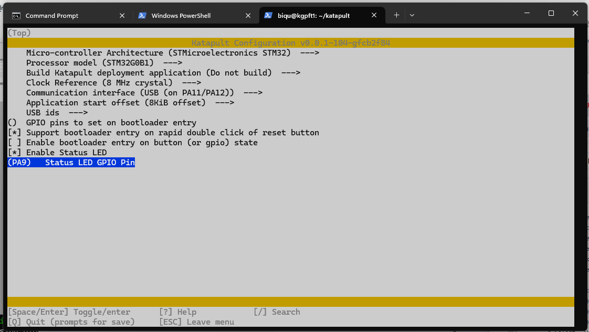

38. Enter
    ```
    make clean
    ```
    ```
    make
    ```
    ```
    cp out/katapult.bin ~/bin
    ```
    ```
    cd ~
    ```

39. Enter:
    ```
    chmod 777 bin/*.bin
    ```

### Flash Katapult on KGP 4x2209 if NOT Present/Otherwise Jump to Step 43.

40. Enter the following command and check to see that there is a device with "ID" `0483:df11` (the Orange LED above the `RESET` button is lit when the KGP 4x2209 is in DFU Mode):
    ```
    lsusb
    ``` 
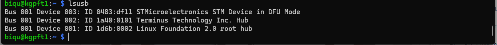

41. If KGP 4x2209 is **NOT** in DFU mode (no "ID" `0483:df11` found):
    * If a NewHat3 is on the board Enter:
    ```
    python python/enableDFU.py
    ```
    * Else press the `BOOT0` Button followed by the Pressing the `RESET` button, releasing the `RESET` button and then release the `BOOT0` button.  Repeat the `lsusb` and Orange LED check in the previous step

42. Flash Katapult into the KGP 4x2209 board using the command:
    ```
    sudo dfu-util -a 0 -D ~/katapult/out/katapult.bin --dfuse-address 0x08000000:force:mass-erase:leave -d 0483:df11
    ```

### Flash KGP 4x2209 with Firmware

43. Check for Katapult active by verifying the flashing LED on KGP 4x2209.
    * If not flashing:
        * if NewHat3a is installed, enter
          ```
          python python/enableKatapult.py
          ```
        * else press "RESET" twice
    
44. Enter the following command to display the USB Device Address:
    ```
    ls /dev/serial/by-id
    ``` 

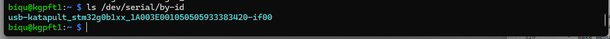

45. Using the USB Serial Address found in the Previous Step, Flash the DFU Mode Enable firmware using the  command:
    ```
    python3 ~/katapult/scripts/flashtool.py -f ~/bin/KGP_4x2209_DFU.bin -d /dev/serial/by-id/{USB ADDRESS FOUND IN PREVIOUS STEP}
    ```
    * This will result in the DFU repeatedly Flashing three times quickly followed by one lone flash

46. Enable Katapult again.
    * If a NewHat3 is on the board execute
      ```
      python ~/python/enableKatapult.py
      ```
    * Else Press `RESET` twice quickly which will enable Katapult and the DFU LED will flash on and off regularly

47. Check for Katapult active by verifying the flashing LED on KGP 4x2209 and then enter the following command to display the USB Device Address:
    ```
    ls /dev/serial/by-id
    ``` 


    
48. Using the USB Serial Address found in the Previous Step, Flash Klipper using the command:
    ```
    python3 ~/katapult/scripts/flashtool.py -f ~/bin/klipper.bin -d /dev/serial/by-id/{USB ADDRESS FOUND IN PREVIOUS STEP}
    ```

49. Check to see that Klipper was installed using the following command and compare to the expected result:
    ```
    ip -s -d link show can0
    ```

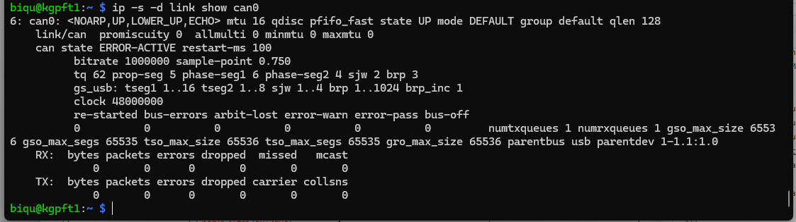

50. Get the CAN UUID using the following command with the expected result:
    ```
    ~/klippy-env/bin/python ~/klipper/scripts/canbus_query.py can0
    ```


51. Create an `mcu.cfg` file using the command:
    ```
    printf "[mcu]\ncanbus_uuid: {UUID FOUND IN PREVIOUS STEP}\n" > ~/printer_data/config/mcu.cfg
    ```

52. Enter:
    ```
    sudo service klipper start
    ```

53. Copy the `printer.cfg` file from this GitHub repository in the `configs` folder into the `http://kgpft1` Mainsail "MACHINE" web page.

54. Click on "SAVE AND RESTART` and Klipper should come up with the screen:

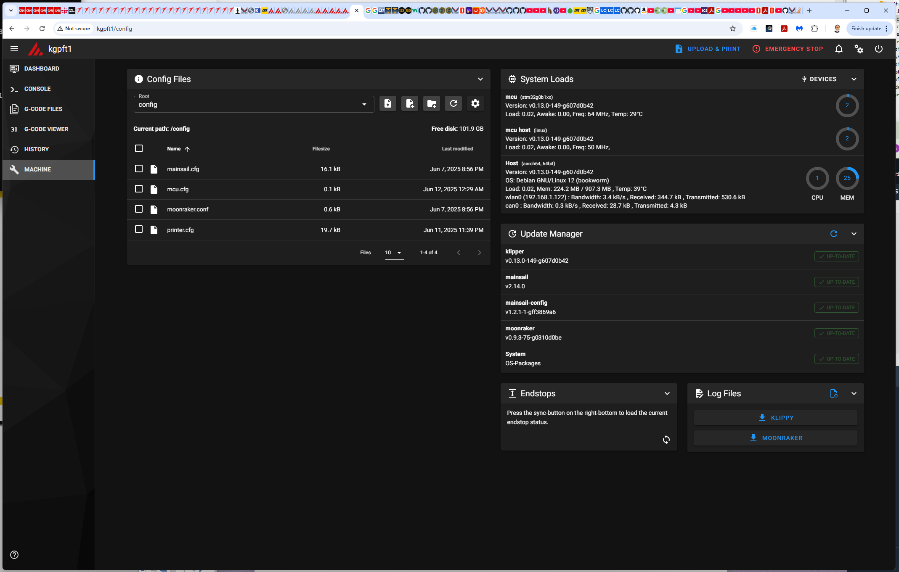

### Install Dynamic Macros

* Following instructions found at: [Dynamic Macros Setup](https://dynamicmacros.3dcoded.xyz/setup/)

55. Uncomment the `[dynamicmacros]` statement in the `printer.cfg`
   
56. From Mainsail, edit `moonraker.conf` and add the lines at the end of the file:
```
# DynamicMacros Update Manager
[update_manager DynamicMacros]
type: git_repo
path: ~/DynamicMacros
origin: https://github.com/3DCoded/DynamicMacros.git
primary_branch: main
is_system_service: False
install_script: install.sh
```

57. Execute bash script using:
    
    ```
    curl -s https://raw.githubusercontent.com/3dApothecary-xyz/FunctionalTest/refs/heads/main/scripts/ftload2.sh | bash
    ```

    * `cd ~/printer_data/config`
    * `wget -O dynamic.cfg https://github.com/3dApothecary-xyz/FunctionalTest/blob/main/configs/dynamic.cfg?raw=true`
    * `wget -O read_tmc_field.py https://github.com/3dApothecary-xyz/FunctionalTest/blob/main/configs/read_tmc_field.py?raw=true`
    * `chmod 777 dynamic.cfg`
    * `chmod 777 *.py`
    * `cd ~`

    * Install Dyanmic Macros using
        * `git clone https://github.com/3DCoded/DynamicMacros`
        * `cd DynamicMacros`
        * `sh install.sh`
        * `sudo service klipper restart`
        * `cd ~`
   
58. Check to see that Klipper has restarted properly in Mainsail

59. Check to see that there is a `.dynamicmacros.cfg` file in `~/printer_data/config` using the command
    ```
    ls ~/printer_data/config -al
    ```

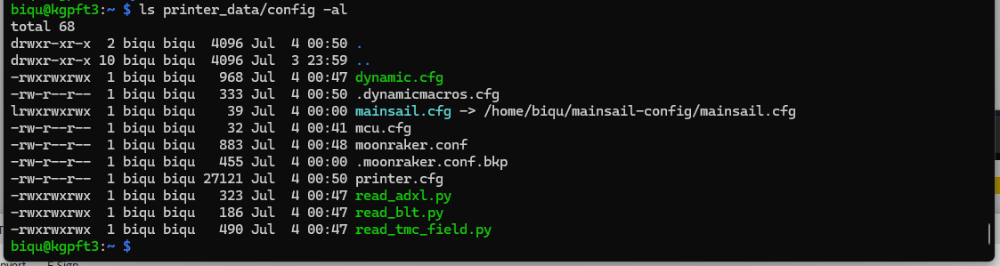

60. Check to see that there is a `[include .dynamicmacros.cfg]` statement at the start of `printer.cfg`

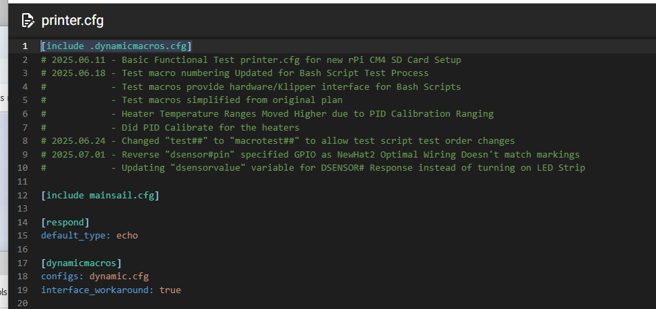

### Flash Katapult on Toolhead Controller if NOT Present/Otherwise Jump to Step 72.

61. On EBB42, Put in `120R` and `VBUS` Jumpers

62. Connect EBB42 to KGP 4x209 using USB C to USB A Cable

63. Press the `BOOT` Button followed by cycling `RST` to put the EBB42 into DFU Mode as shown in the following image:

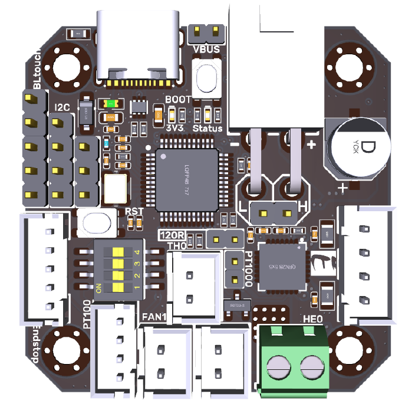

64. Check that the Toolhead Controller is in DFU Mode by using the following command which should produce the result:
    ```
    lsusb
    ``` 

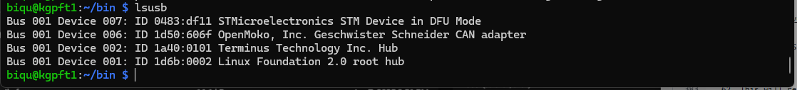

65. Move to the Katapult Folder using the command
    ```
    cd ~/katapult
    ```

66. Configure Katapult for the Toolhead Controller using the folloiwng command with the Paramters:
    ```
    make menuconfig
    ```

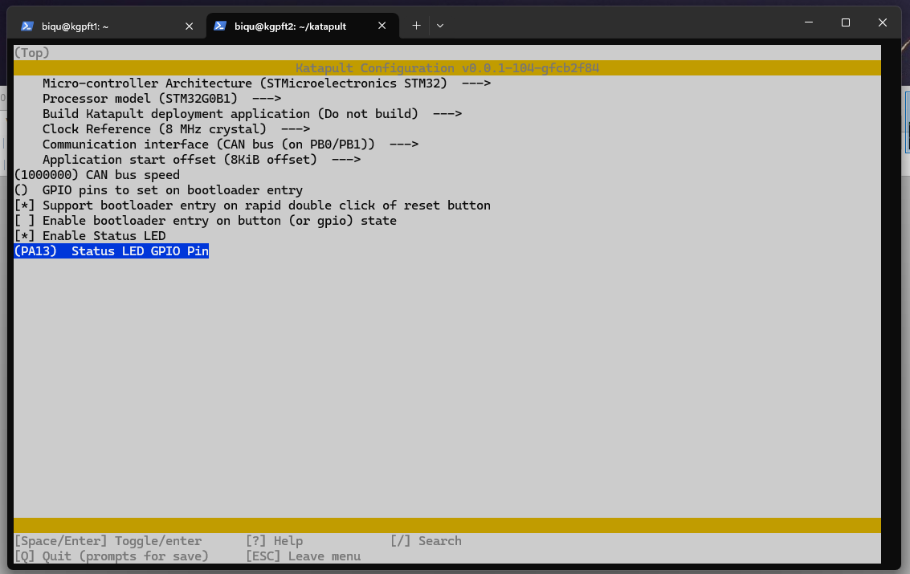

67. Save menuconfig paramters by entering `Q` and then `Y`
    ```
    make clean
    ```
    ```
    make
    ```

68. Flash the Toolhead Controller with Katapult using the command:
    ```sudo dfu-util -a 0 -D ~/katapult/out/katapult.bin --dfuse-address 0x08000000:force:mass-erase:leave -d 0483:df11```

69. Enter:
    ```
    sudo shutdown now
    ```
    * Then turn off Power when White CM4 LED stops flashing

70. With Power off, unplug the Toolhead Controller from the KGP 4x2209 USB port and reattach it using the CAN connection

71. Power Up, wait for the Raspberry Pi CM4 to come up and login using SSH

### Flash Toolhead Controller with Firmware

72. Check that the Toolhead Controller is active and properly wired with Katapult active using the following command which should return:
    ```
    ~/klippy-env/bin/python ~/klipper/scripts/canbus_query.py can0
    ```

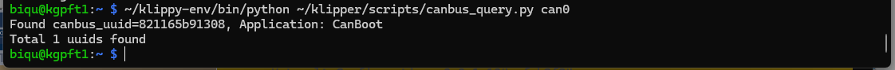

73. If Katapult not active on the Toolhead Controller, press "RESET" on the Toolhead Controller and repeat the previous step

74. Enter:
    ```
    cd ~/klipper
    ```

75. Configure Klipper for the Toolhead Controller using the following command with the Parameters:
    ```
    make menuconfig
    ```

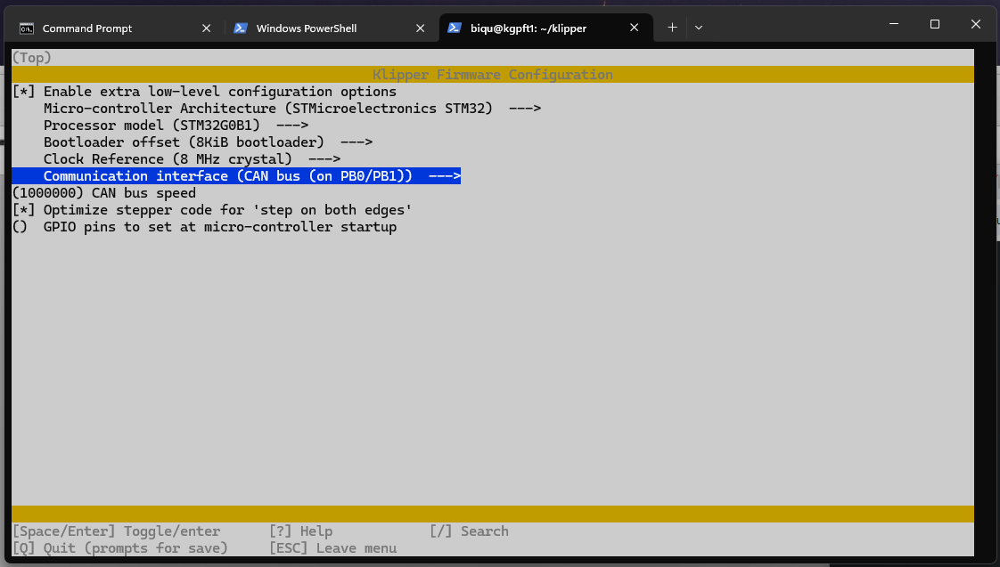

    * Save menuconfig paramters by entering `Q` and then `Y`
    ```
    make clean
    ```
    ```
    make
    ```

76. Enter
    ```
    sudo service klipper stop
    ```
    
77. Enter the following command which should return something like:
    ```
    python3 ~/katapult/scripts/flashtool.py -i can0 -q
    ```

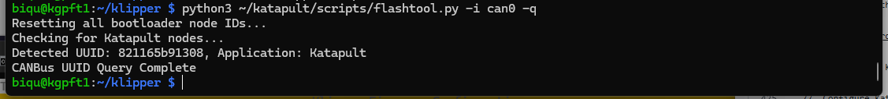

78. Flash the Toolhead Controller using
    ```
    python3 ~/katapult/scripts/flashtool.py -i can0 -f ~/klipper/out/klipper.bin -u {UUID FOUND IN PREVIOUS STEP}
    ```

79. Check for the CAN UUID using the following command which will return the Klipper CAN UUID:
    ```
    python3 ~/katapult/scripts/flashtool.py -i can0 -q
    ```

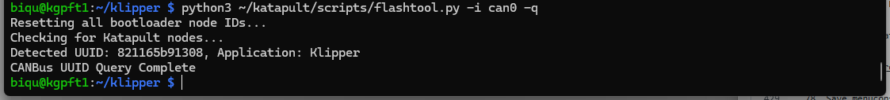

80. Create the `toolhead.cfg` file using the command
     ```
     printf "[mcu toolhead]\ncanbus_uuid: {UUID FOUND IN PREVIOUS STEP}\n" > ~/printer_data/config/toolhead.cfg
     ```

81. Edit `printer.cfg` on the Mainsail webpage and Remove comments on the `[include toolhead.cfg]` and `[temperature_sensor toolhead_temp]` statements

82. Enter the following command and Klipper should start up as:
     ```
     sudo service klipper start
     ```

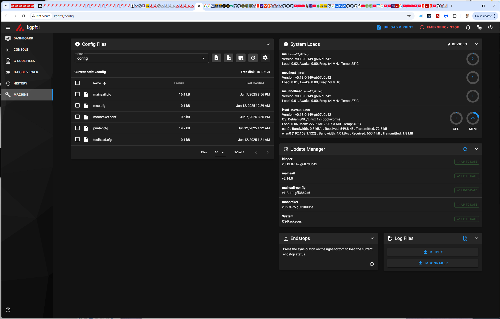
