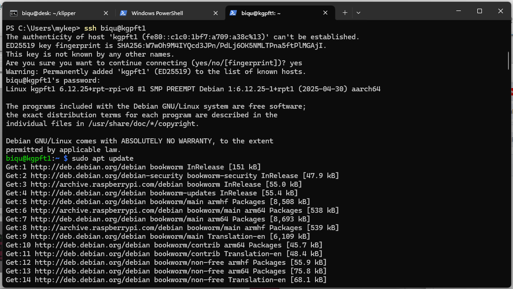
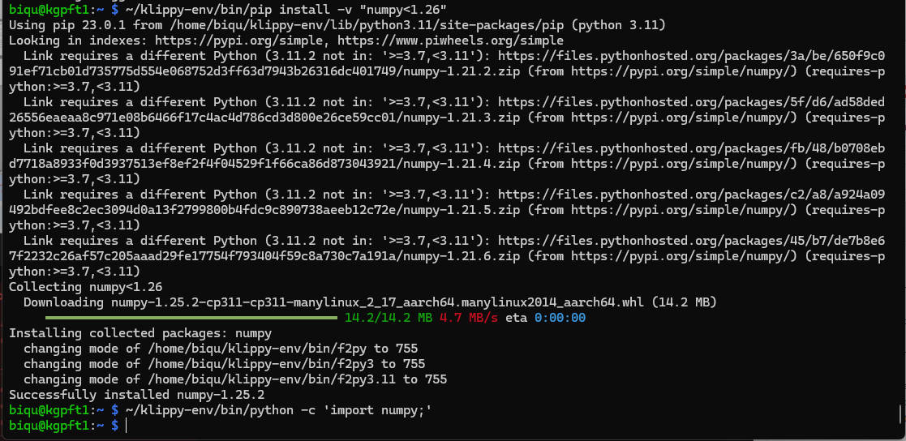
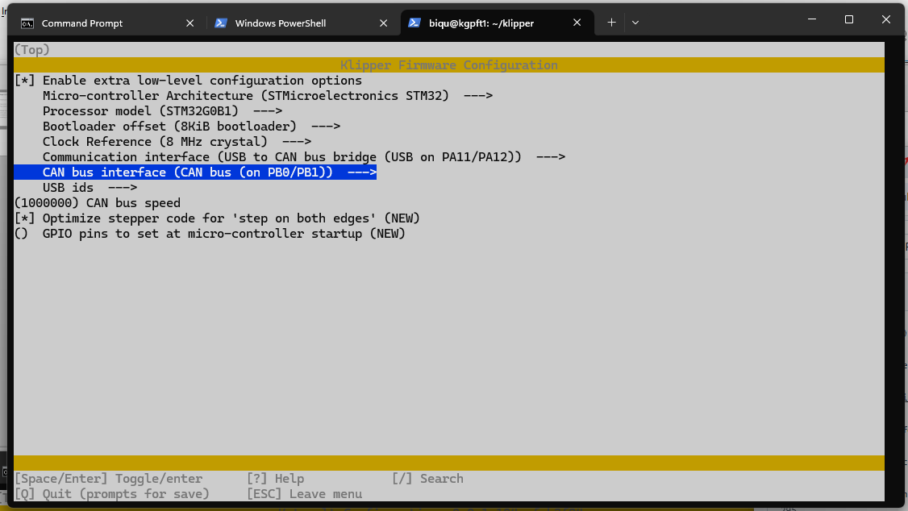

# KGP 4x2209 FunctionalTest

## Functional Test Apparatus

* Manufacturer Supplied: KGP 4x2209 "Board Under Test"
* Manufacturer Supplied: 24V/5A "Bench Power Supply" with Digital Outputs and Overcurrent Protection
* Manufacturer Supplied: 1920 x 1080p "HDMI Monitor"
* Manufacturer Supplied: Full Sized HDMI Cable (for Board Under Test to HDMI Monitor)
* Manufacturer Supplied: USB Keyboard (US Key Layout)
* Manufacturer supplied: Ethernet Cable with RJ45 Connector to Active Internet Connection
* Company Supplied: Silicon Solder Pad with Test Apparatus Markings and Parts
* Company Supplied: [Raspberry Pi CM4 (CM4101000)](https://datasheets.raspberrypi.com/cm4/cm4-product-brief.pdf)
* Company Supplied: Micro SD Card 64GB or larger
* Company Supplied: Red/Black Power Wiring from Bench Power Supply to Board Under Test
* Company Supplied: ["NewHat2" Raspberry Pi GPIO Hat](https://github.com/3dApothecary-xyz/NewHat2)
* Company Supplied: 6 Pin Ribbon Cable from NewHat2 to Board Under Test
* Company Supplied: Red JST XH 3 Pin to Dupont 3 Pin Socket Wire
* Company Supplied: Black JST XH 3 Pin to Dupont 3 Pin Socket Wire
* Company Supplied: Yellow JST XH 3 Pin to Dupont 3 Pin Socket Wire
* Company Supplied: Blue JST XH 3 Pin to Dupont 3 Pin Socket Wire
* Company Supplied: Green JST XH 3 Pin to Dupont 3 Pin Socket Wire
* Company Supplied: 4x 15cm long 24V LED Strip Lighting on 2 Pin Dupont Connector
* Company Supplied: 2x 8 NeoPixel LED strips on 3 Pin Dupont Connector
* Company Supplied: ADXL345 Prototype Board with 8 Pin Header 
* Company Supplied: 6Pin Ribbon Cable with 8 Pin Dupont Connector and 6 Pin Dupont Connector
* Company Supplied: BTT EBB42 Toolhead Controller
* Company Supplied: CANBus Cable to Connect Board Under Test to BTT EBB42 Toolhead Controller
* Company Supplied: [Antclabs "BLTouch" v3.1 Sensor](https://www.antclabs.com/bltouch-v3) Mounted to "BLTouch" Stepper Motor Base
* Company Supplied: "BLTouch" Custom Stepper Motor Base with Striker Mount on Stepper Motor
* Company Supplied: 12V+ Inductive Probe Mounted to Stepper Motor Base
* Company Supplied: 12V+ Inductive Probe Custom Stepper Motor Base with Striker on Stepper Motor
* Company Supplied: 2x Custom Motor Base with Striker
* Company Supplied: 4x Lerdge NEMA 17 42mm Motors with Dupont Connectors

## Functional Test Process

* `sudo service klipper stop`
  
* loadFlag = 7

* Show "FIRMWARE LOAD" Message

* sleep 5s

* Enable DFU Mode on Board Under Test's MCU (Hold `BOOT0` high, cycle `RESET`)

* sleep 2s

*     if **NOT** in DFU Mode
*         Cycle Reset 2x (Enable Katapult in MCU)
*         if Katapult Active
*             loadFlag = 3
*         else
*             ERROR - Unable to load firmware into Board Under Test's MCU

*     if (loadFlag & 4)  //  Board will be in DFU Mode
*         Flash `katapult.bin` using dfu-util
*         sleep 1s
*         Cycle Reset 2x (Enable Katapult in MCU)
*         sleep 1s

*     if NOT Katapult Active
*         ERROR - Unable to load firmware into Board Under Test's MCU

*     if (loadFlag & 2)  //  Flash DFU Enable in Option Bytes
*         Flash `SKR_Mini_E3_V3_DFU.bin` using Katapult
*         sleep 1s
*         Cycle Reset 2x (Enable Katapult in MCU)
*         sleep 1s

*     if NOT Katapult Active
*         ERROR - Unable to load firmware into Board Under Test's MCU

*     if (loadFlag & 1)  //  Flash Klipper Firmware
*         Flash `klipper.bin` using Katapult
*         sleep 1s
*         Cycle Reset 2x (Enable Katapult in MCU)
*         sleep 1s

* Show "KLIPPER START" Message

*     if `mcu.cfg` exists
*         erase `mcu.cfg`

* Using `ls /dev/serial/by-id` Create `mcu.cfg`

* `sudo service klipper start`

* sleep 5s // **NOTE:** This needs to be timed to understand how long it takes for Klipper to come up

*     for (i = 0; 5 > i; ++i)
*         if klipper "READY"
*             break
*         endif
*         sleep 1s
*         execute FIRMWARE_RESTART
*         sleep 5s // **NOTE:** This needs to be time to understand how long is required for Klipper to come up
*     if 5 <= i
*         ERROR - Klipper not coming up after MCU Flashed with Katapult, DFU Mode Enable, Klipper firmware

* Show "FUNCTIONAL TEST START" Message

* `TEST01:` Network Connections (Ping Internet Site to test Board Under Test's Ethernet Port using `sineosPING.sh`)
* `TEST02:` Read Power Input (`VINMON`) Level (Check Input Power Level)
* `TEST03:` Read MCU Temperature (MCU Presence Check)
* `TEST04:` Read Toolhead MCU Temperature (Toolhead Presence Check)
* `TEST05:` Ensure (`HEATER0` temp < 30C) && (`HEATER0` temp > 0C) (`HEATER0` thermistor Presence Check and at temperature appropriate for `HEATER0` functional test)
* `TEST06:` Ensure (`HEATER1` temp < 30C) && (`HEATER1` temp > 0C) (`HEATER1` thermistor Presence Check and at temperature appropriate for `HEATER1` functional test)
* `TEST07:` Set `HEATER0` to 40C (This is an operation that cannot pass or fail but given the label "TEST" so it can use the standard test macro formatting)
* `TEST08:` Set `HEATER1` to 40C (This is an operation that cannot pass or fail but given the label "TEST" so it can use the standard test macro formatting)
* `TEST09:` ADXL345 Presence Check
* `TEST10:` BLTouch Presence Check (Also Set Probe Position and check probe status)
* `TEST11:` `NEOPIXEL0` Presence Check (User Operator must confirm `NEOPIXEL0` has a red output.  `NEOPIXEL0` is turned off after test)
* `TEST12:` `NEOPIXEL1` Presence Check (User Operator must confirm `NEOPIXEL1` has a red output.  `NEOPIXEL1` is turned off after test)
* `TEST13:` `DSENSOR0` Functional Test (Operator to confirm that Yellow LED by Connector is lit)
* `TEST14:` `DSENSOR1` Functional Test (Operator to confirm that Yellow LED by Connector is lit)
* `TEST15:` `DSENSOR2` Functional Test (Operator to confirm that Yellow LED by Connector is lit)
* `TEST16:` `DSENSOR3` Functional Test (Operator to confirm that Yellow LED by Connector is lit)
* `TEST17:` `DSENSOR4` Functional Test (Operator to confirm that Yellow LED by Connector is lit)
* `TEST18:` 'FAN0' Operations Check (Operator to confirm Blue LED on Board Under Test is lit and LED strip is lit.  After confirmation `DSENSOR1` is no longer driven so that Blue LED and LED strip are off)
* `TEST19:` 'FAN1' Operations Check (Operator to confirm Blue LED on Board Under Test is lit and LED strip is lit.  After confirmation `DSENSOR1` is no longer driven so that Blue LED and LED strip are off)
* `TEST20:` 'FAN2' Operations Check (Operator to confirm Blue LED on Board Under Test is lit and LED strip is lit.  After confirmation `DSENSOR2` is no longer driven so that Blue LED and LED strip are off)
* `TEST21:` 'FAN3' Operations Check (Operator to confirm Blue LED on Board Under Test is lit and LED strip is lit.  After confirmation `DSENSOR3` is no longer driven so that Blue LED and LED strip are off)
* `TEST22:` 'G28 X` Test to check stepper movement and sensorless homing operation 
* `TEST23:` 'G28 Y` Test to check stepper movement and sensorless homing operation
* `TEST24:` 'G28 Z` Test to check stepper movement and sensorless homing operation
* `TEST25:` Functional Test of Inductive Sensor on Y-Axis stepper 
* `TEST26:` Functional Test of BLTouch on Z-Axis stepper
* `TEST27:` Ensure 'HEATER0` > 30C (When complete, set `HEATER0` to 0C)
* `TEST28:` Ensure 'HEATER1` > 30C (When complete, set `HEATER1` to 0C)

* Show "TEST COMPLETE" Message
* `NEOPIXEL0` and `NEOPIXEL1` set to output blue light

* Show "FIRMWARE SEALING" Message

* `sudo service klipper stop`
* sleep 2s
* Cycle Reset 2x (Enable Katapult in MCU - Assume that this will work and there's no need to check it's active)
* sleep 2s
* load `nada.bin`
* sleep 5s

* `sudo shutdown now`

## Raspberry Pi CM4 Configuration Instructions

### Setup Raspberry Pi CM4 Operating System

1. Assume Raspberry Pi CM4 as the KGP 4x2209 Klipper "Host"
   
3. Use 64GB+ Micro SD Card for loading OS for the Raspberry Pi

4. Start up the Raspberry Pi Imager

5. Insert Micro SD Card for use with Raspberry Pi Imager

6. In Raspberry Pi Imager's Main Page, specify:
   * `RASPBERRY PI 4` for "Raspberry Pi Device"
   * `RASPBERRY PI OS LITE (64-BIT)` for "Operating System"
   * `Micro SD Card for use with Raspberry Pi Imager` for "Storage"
  

7. Click "Next" in Raspberry Pi Imager

8. The "OS Customisation" Window comes up.  Make the following entries:
   * "Set hostname:" to `kgpft1`
   * "Set username and password"
      * "Username:" to `biqu`
      * "Password:" to `biqu`
   * Deselect "Configure wireless LAN"
   * "Set locale settings"
      * "Time zone:" to `America/Toronto`
      * "Keyboard layout:" to `us`

9. Click on `SAVE` in the "OS Customisation" Window and then click `Yes` to "apply OS customisation settings?"

10. Click on `Yes` to "Are you sure you want to continue?"

11. Wait for Micro SD Card to be configured

12. When finished, install the Micro SD Card into a `KGP 4x2209` board which has a Raspberry Pi CM4 installed

13. Connect the `KGP 4x2209` to an Ethernet internet connection
   
14. Apply power (ideally 24V) to the `KGP 4x2209`

15. Wait 5 minutes for first boot of the Raspberry Pi CM4

16. Using a computer which is connected to the same network as the Ethernet internet connection used by the `KGP 4x2209`:
    * Start up a terminal window (No need for PuTTY)
    * SSH into the board using `ssh biqu@kgpft1`
    * Enter `yes` if the question appears: "The authenticity of host 'kgpft1 ... Are you sure you want to continue connecting (yes/no/[fingerprint])?"
    * Enter the password `biqu`
      

17. Enter `sudo apt update`

18. Enter `sudo apt upgrade -y`

### Enable CANBus Operation

* Following instructions found at: [Estoterical CANBus Guide](https://canbus.esoterical.online/Getting_Started.html)

19. `sudo systemctl enable systemd-networkd`

20. `sudo systemctl start systemd-networkd`

21. Check to see that networkd is operating using the command `systemctl | grep systemd-networkd`

22. `sudo systemctl disable systemd-networkd-wait-online.service`

23. `echo -e 'SUBSYSTEM=="net", ACTION=="change|add", KERNEL=="can*"  ATTR{tx_queue_len}="128"' | sudo tee /etc/udev/rules.d/10-can.rules > /dev/null`

24. Check to see that the CAN rules were applied correctly using: `cat /etc/udev/rules.d/10-can.rules`

25. `echo -e "[Match]\nName=can*\n\n[CAN]\nBitRate=1M\nRestartSec=0.1s\n\n[Link]\nRequiredForOnline=no" | sudo tee /etc/systemd/network/25-can.network > /dev/null`

26. Check to see that the CAN Network Parameters were set correctly using: `cat /etc/systemd/network/25-can.network`

27. `sudo reboot now`

28. Wait 2 minutes for Raspberry Pi CM4 to reboot

29. `ssh biqu@kgpft1` and enter password `biqu` when prompted

### Download Necessary Files from GitHub

* Following instructions found at: [Pi My Life Up/raspberry-pi-gpio](https://pimylifeup.com/raspberry-pi-gpio/)

30. `sudo apt-get update && sudo apt-get install git -y`

### Enable Raspberry Pi CM4 GPIO Operation

* Following instructions found at: [Pi My Life Up/raspberry-pi-gpio](https://pimylifeup.com/raspberry-pi-gpio/)

31. Dowload python utilities:
    * `mkdir python`
    * `cd python`
    * `wget -O cycle38.py https://github.com/3dApothecary-xyz/FunctionalTest/blob/main/python/cycle38.py?raw=true`
    * `wget -O cycleRESET.py https://github.com/3dApothecary-xyz/FunctionalTest/blob/main/python/cycleRESET.py?raw=true`
    * `wget -O enableDFU.py https://github.com/3dApothecary-xyz/FunctionalTest/blob/main/python/enableDFU.py?raw=true`
    * `wget -O enableKatapult.py https://github.com/3dApothecary-xyz/FunctionalTest/blob/main/python/enableKatapult.py?raw=true`
    * `cd ~`
      
33. Test python operation with: `python python/cycle38.py`
    * Check Pin 38 on KGP 4x2209's Raspberry Pi 40Pin Connector with a DMM: Pin should be cycling between 0V and 3.3V every 2 Seconds

### Load Klipper using KIAUH

* Following instructions found at: [GitHub KIAUH Repository](https://github.com/dw-0/kiauh)

34. `git clone https://github.com/dw-0/kiauh.git`

35. `./kiauh/kiauh.sh`
    * If asked to try out KIAUH 6 enter `3` which is `3) Yes, remember my choice for next time`
    * Select `2) [Update]`
    * if Option `9) System` does NOT say `No upgrades available.` then:
    *       Select `9) System`
    *       Wait for System Updates to complete
    *       Select `B) << Back` to exit Update Panel
    *       Select `Q) Quit` to leave KIAUH
    *       `./kiauh/kiauh.sh` to restart KIAUH
    *       Select `2)[Update]` to return to KIAUH Update Screen
   
36. Select `B) << Back` to exit Update Panel
    * Select `1) [Install]` to go to Klipper Installation Panel
    * Select `1) [Klipper]` to Install Klipper on the Raspberry Pi CM4.  Select default options when prompted
    * Select `2) [Moonraker]` to Install Moonraker on the Raspberry Pi CM4.  Select default options when prompted
    * Select `3) [Mainsail]` to Install Mainsail on the Raspberry Pi CM4.  Select default options when prompted
    * Select `B << Back` to return to the main menu
    * Select `Q) Quit` to exit KIAUH

37. Check Klipper installation by loading the Mainsail webpage: `http://kgpft1`

### Load Numpy for ADXL345 Testing

* Following instructions found at: [Measuring Resonances: Software Installation](https://www.klipper3d.org/Measuring_Resonances.html#software-installation)

38. `sudo apt install python3-numpy python3-matplotlib libatlas-base-dev libopenblas-dev -y`

39. `~/klippy-env/bin/pip install -v "numpy<1.26"`

40. Check Numpy installation using: `~/klippy-env/bin/python -c 'import numpy;'` - Result should be a simple return:

### Load Katapult

* Following instructions found at: [GitHub Katapult Repository](https://github.com/Arksine/katapult)

41. `git clone https://github.com/Arksine/katapult`

### Make Firmware Images

42. Download Premade Firmare Images
    * `mkdir bin`
    * `cd bin`
    * `wget -O nada.bin https://github.com/3dApothecary-xyz/FunctionalTest/blob/main/bin/nada.bin?raw=true`
    * `wget -O MINI_E3_V3_DFU.bin https://github.com/3dApothecary-xyz/SKR_Mini_E3_V3_DFU/blob/main/bin/MINI_E3_V3_DFU.bin?raw=true`
    * `cd ~`

42. Make `katapult.bin` for Board Under Test 
    * `cd katapult`
    * `make menuconfig` - Match settings with screen shot below and enter `Q` followed by `Y` to save

    * `make clean`
    * `make`
    * `cp out/katapult.bin ~/bin`
    * `cd ~`

43. Make `klipper.bin` for Board Under Test 
    * `cd klipper`
    * `make menuconfig` - Match settings with screen shot below and enter `Q` followed by `Y` to save

    * `make clean`
    * `make`
    * `cp out/klipper.bin ~/bin`
    * `cd ~`
   
### Flash Toolhead

### Test Micro SD Card Image with KGP 4x2209 & CANBus Toolhead Controller
